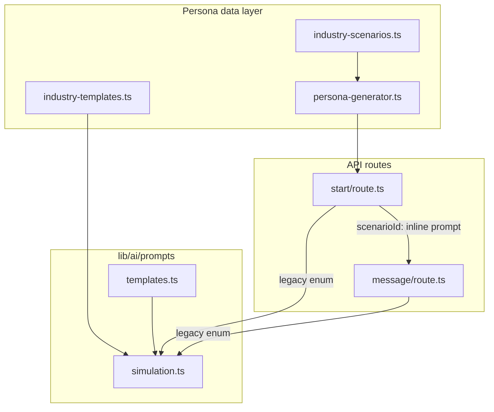

# Audit: `lib/ai/prompts` Directory

## Executive Summary

| Field | Value |
|--------|--------|
| **Audit topic / scope** | Structure, persona generation, and extraction prompts under `lib/ai/prompts/`, including how API routes consume them |
| **Date** | 2026-04-15 |
| **Overall score (1–10)** | **6.5** — Solid modular building blocks (`templates`, pattern extraction) with clear intent; weakened by split-brain persona prompting (inline in routes vs. library), registry drift, and weak coupling to centralized `PROMPT_CONFIGS`. |
| **Maturity** | **Early production** — usable and documented, but maintenance and consistency risks will grow with more industries and flows. |
| **Severity distribution** | Critical: **0**, High: **2**, Medium: **4**, Low: **3** |
| **Total findings** | **9** |

### Category scores (1–10)

| Category | Score | One-line summary |
|----------|-------|------------------|
| Structure & cohesion | 7 | Clear files by concern; central `index` is incomplete vs. actual modules. |
| Persona / simulation prompting | 6 | Industry-template path is strong; new scenario path duplicates large prompt strings in HTTP handlers. |
| Extraction prompting | 7 | Pattern extraction is thorough and perspective-aware; CLOSER extraction is focused but lives outside the registry. |
| Config & operational consistency | 5 | `PROMPT_CONFIGS` exists but call sites often hardcode model parameters. |

---

## Audit scope and methodology

**In scope**

- All TypeScript modules under `lib/ai/prompts/` (`config`, `templates`, `simulation`, `pattern-extraction`, `closer-extraction`, `lead-assistant`, `index`, `utils/validation`).
- Primary consumers: `lib/ai/extract-patterns.ts`, `app/api/v1/simulations/start/route.ts`, `app/api/v1/simulations/[id]/message/route.ts`, `app/api/v1/simulations/[id]/extract/route.ts`, `app/api/v1/profile/re-extract/route.ts`, `app/api/v1/public/lead-chat/.../message/route.ts`.
- Related **non-prompt** persona generation in `lib/templates/persona-generator.ts` (because it defines structured personas that prompts wrap).

**Out of scope**

- Full security review of AI endpoints (only prompt-layer notes).
- Prisma schema and `BusinessProfile` JSON shapes beyond what prompts assume.

**Methodology**

- Static review of the prompt directory and grep for imports of `@/lib/ai/prompts` and `prompts/`.
- Trace of runtime paths: simulation start (legacy vs. scenarioId), message continuation, pattern extraction, CLOSER extraction, lead assistant.

**Rules cross-check (project `.cursor/rules`)**

- **[CODE-002]** Configuration: central `config.ts` exists, but several routes bypass it for `maxTokens` / temperature — weak alignment with “do not hard-code configuration” for AI calls.
- **[ERR-001]/[ERR-003]** Error handling: prompt modules themselves rarely swallow errors; CLOSER parse failures are handled in routes (outside this folder) by logging and continuing with `null`.
- **[DOC-001]** Changelog under `lib/ai/prompts/CHANGELOG.md` is present and useful for this subsystem.

---

## Current directory structure

```
lib/ai/prompts/
├── CHANGELOG.md           # Version history for prompt subsystem
├── index.ts               # Re-exports + AVAILABLE_PROMPTS registry (partial)
├── config.ts              # Model aliases + PROMPT_CONFIGS + TOKEN_BUDGETS
├── templates.ts           # BEHAVIOR_RULES, OUTPUT_FORMATS, INDUSTRY_CONTEXT, buildPrompt()
├── simulation.ts          # Legacy scenario prompts + generateSimulationPrompt()
├── pattern-extraction.ts  # System stub + generatePatternExtractionPrompt() + transcript formatter
├── closer-extraction.ts   # CLOSER-focused owner voice JSON prompt + TS interface
├── lead-assistant.ts      # buildLeadAssistantSystemPrompt() for widget chat
└── utils/
    └── validation.ts      # Token estimate, validatePrompt, metrics, warnings
```

**Not exported from `index.ts`:** `closer-extraction.ts` and `lead-assistant.ts` — consumers import them by direct path (`@/lib/ai/prompts/closer-extraction`, `@/lib/ai/prompts/lead-assistant`).

---

## How AI personas are generated today

Persona generation is **not fully owned by the prompts directory**. It is a **two-layer system**:

### 1) Structured persona data (deterministic, outside `prompts/`)

- **`lib/templates/persona-generator.ts`** builds a `SimulationPersona`: random age band, name pool, budget range, personality and pain-point subsets, timeline, `openingLine`, and `backstory`, all driven by an `IndustryScenario` from `lib/templates/industry-scenarios.ts`.
- This is **algorithmic**, not LLM-generated persona JSON.

### 2) Persona + context wrapping (LLM system / user messages)

**A. New simulations (`scenarioId` path)** — `app/api/v1/simulations/start/route.ts`

- After `generatePersona(scenario)`, the **entire client system prompt is a template literal** in the route: industry, service, target client, budget range, persona fields, rules, and the forced opening line.
- First turn uses `createChatCompletion` with that string as the **system** parameter (via your client wrapper) and a short user message to begin.

**B. Continuing simulations (`scenarioId` path)** — `app/api/v1/simulations/[id]/message/route.ts`

- For non-legacy `scenarioType`, the route **rebuilds a parallel prompt** from `personaDetails`, `businessProfile`, and optional `getScenarioById` — again **inline**, not imported from `lib/ai/prompts`.

**C. Legacy enum scenarios** — `PRICE_SENSITIVE` … `HIGH_BUDGET`

- **Start:** `generateSimulationPrompt(scenarioType, businessProfile)` from `lib/ai/prompts/simulation.ts`, which composes `buildPrompt()` with industry templates from `getIndustryTemplate()` / `lib/templates/industry-templates.ts`, plus scenario slice `template.scenarios[scenarioType]`.
- **Fallback:** if no industry template, `generateSimulationClientPrompt(getScenarioConfig(...))` — generic consulting-style client.
- **Messages:** same `generateSimulationPrompt` for legacy types only.

**Summary diagram (conceptual)**



**Finding:** persona *behavior* for the modern path is defined **in HTTP routes**, while the legacy path uses **shared library prompts**. This split increases the risk of inconsistent rules (length, industry lock, opening-line handling) when one path is updated.

---

## How extraction works today

### Pattern extraction (broad business profile)

| Step | Location | Behavior |
|------|-----------|----------|
| Transcript | `formatConversationTranscript` in `pattern-extraction.ts` | Maps `AI_CLIENT` → `CLIENT`, owner → `YOU`; joins messages. |
| User payload | `generatePatternExtractionPrompt(transcript, industry, scenarioType)` | Large instruction block + embedded JSON schema + few-shot style examples; assembled with `buildPrompt()` and `OUTPUT_FORMATS.json`. |
| System message | `PATTERN_EXTRACTION_SYSTEM_PROMPT` | Short “expert analyst” role + **critical perspective rule** (owner vs. customer). |
| Orchestration | `lib/ai/extract-patterns.ts` | Passes **user** = full built prompt, **system** = `PATTERN_EXTRACTION_SYSTEM_PROMPT`; `maxTokens: 4000`, `temperature: 0.3` (hardcoded). |
| Post-processing | Same file | Strip markdown fences, `JSON.parse`, optional `normalizePatterns`, Zod `ExtractedPatternsSchema`. |
| Quality gate | `extractPatternsWithQualityCheck` | Uses `checkSimulationQuality` **before** extraction; re-extract route bypasses this intentionally. |

Design strengths: explicit **owner vs. customer** disambiguation, confidence / `not_demonstrated` patterns, conversation quality section, verbatim voice examples with different rules than abstract style fields.

### CLOSER extraction (owner voice / sales framework)

| Step | Location | Behavior |
|------|-----------|----------|
| Prompt | `generateCloserExtractionPrompt(transcript)` in `closer-extraction.ts` | Single user-oriented mega-prompt with JSON schema for `closerFramework`, `keyPhrases`, `commonQuestions`, `extractionConfidence`, `notes`. Emphasizes **verbatim** owner phrases. |
| Orchestration | `extract/route.ts`, `re-extract/route.ts` | Builds transcript with `Owner`/`Client` labels; `createChatCompletion` with a **minimal separate system string** (not from `closer-extraction.ts`); `maxTokens` often **3000** in extract route — not taken from `PROMPT_CONFIGS`. |
| Parse | Routes | Strip ```json fences, `JSON.parse`; failures → `null` + warn. |

**Finding:** CLOSER extraction is a **second extraction channel** with different transcript labeling (`Owner`/`Client`) than pattern extraction (`YOU`/`CLIENT`), which is fine if documented, but easy to confuse when debugging or training future models.

---

## Findings

| ID | Severity | Title | Location(s) | Impact |
|----|-----------|--------|--------------|--------|
| F-01 | **High** | Persona system prompts duplicated between `start` and `message` routes instead of centralized helpers | `app/api/v1/simulations/start/route.ts` (approx. persona prompt block), `app/api/v1/simulations/[id]/message/route.ts` (new-style branch) | **Technical / maintainability:** rule drift, inconsistent UX, harder reviews. |
| F-02 | **High** | Two persona architectures (legacy template-based vs. scenarioId + inline) | `lib/ai/prompts/simulation.ts` vs. routes above | **Technical:** different grounding strategies; harder onboarding for engineers. |
| F-03 | **Medium** | `lib/ai/prompts/index.ts` registry does not list or export all real prompt modules | `index.ts` vs. `closer-extraction.ts`, `lead-assistant.ts` | **Technical:** discoverability and “single source of truth” claims in comments are inaccurate. |
| F-04 | **Medium** | `AVAILABLE_PROMPTS` includes types with **no** implementation files (`leadQualification`, `summarization`, `intentDetection`) | `lib/ai/prompts/index.ts` | **Technical:** misleading API for future code; suggests dead roadmap items. |
| F-05 | **Medium** | `PROMPT_CONFIGS` / `TOKEN_BUDGETS` not consistently applied at call sites | `lib/ai/prompts/config.ts` vs. `lib/ai/extract-patterns.ts`, `app/api/v1/simulations/[id]/extract/route.ts` | **Technical / ops:** tuning requires editing multiple files; budgets in `getPromptSizeWarning` may never run. |
| F-06 | **Medium** | Unused `prisma` import in `simulation.ts` | `lib/ai/prompts/simulation.ts` line 6 | **Technical:** noise, possible lint failure depending on config. |
| F-07 | **Low** | `getAllPromptConfigs` / `getConfig` use `require()` inside ESM TypeScript | `lib/ai/prompts/index.ts` | **Technical:** inconsistent with rest of codebase; minor bundler/analysis quirks. |
| F-08 | **Low** | Heavy use of `any` / `as any` for `businessProfile` and template fields in `simulation.ts` | `lib/ai/prompts/simulation.ts` | **Technical:** weaker compile-time guarantees for prompt inputs. |
| F-09 | **Low** | Emoji in analyst instructions (`pattern-extraction.ts`) | `lib/ai/prompts/pattern-extraction.ts` | **Technical / minor UX:** some models or logging pipelines handle unicode inconsistently; usually harmless. |

### Detailed notes (selected)

**F-01 / F-02 — Duplication and dual paths**

- Legacy path uses `generateSimulationPrompt` + `getIndustryTemplate` + `buildPrompt` — good reuse of `templates.ts`.
- New `scenarioId` path uses rich persona from `persona-generator` but **does not** call `buildPrompt` or shared behavior constants; duplication violates DRY and [WF-002]-style preservation of behavior across surfaces.

**F-03 / F-04 — Registry accuracy**

- `index.ts` states “Single source of truth for all prompts” but omits CLOSER and lead assistant; `AVAILABLE_PROMPTS` does not include `closerExtraction` or `leadAssistant` and lists unimplemented names.

**F-05 — Config drift**

- `patternExtraction` in `config.ts` defines `maxTokens: 4000` and `temperature: 0.3`, matching `extract-patterns.ts` today — but this is coincidence unless enforced by importing `getPromptConfig('patternExtraction')`.
- CLOSER extraction has **no** entry in `PROMPT_CONFIGS` despite being production-used.

---

## Task consolidation opportunities

1. **Unify persona prompt construction** for `scenarioId` flows: one exported function (e.g. `buildScenarioPersonaSystemPrompt({ scenario, persona, businessProfile })`) colocated with `lib/ai/prompts` or `lib/templates`, used by both `start` and `message`.
2. **Align registry with reality**: either implement missing prompt types or remove them from `AVAILABLE_PROMPTS`; export `closer-extraction` and `lead-assistant` from `index.ts` if they are first-class.
3. **Wire `getPromptConfig` + `getTokenBudget`** (and optional `getPromptSizeWarning`) into `extract-patterns.ts` and CLOSER call sites in one pass.

---

## Recommendations

1. **Treat `lib/ai/prompts` as the only place for multi-line system instructions** for simulations, including the new persona path — routes should pass structured inputs, not author prompts.
2. **Add `closerFramework` (or similar) to `PROMPT_CONFIGS`** with version string aligned to prompt changes in `closer-extraction.ts`.
3. **Remove unused imports** (`prisma` in `simulation.ts`) and tighten types for `businessProfile` (even a partial Zod or interface matching Prisma JSON fields).
4. **Document transcript conventions** in `CHANGELOG.md` or a short `README.md` under `lib/ai/prompts`: `YOU`/`CLIENT` vs. `Owner`/`Client` and why.

---

## Phased fix plan

| Phase | Focus | Actions |
|-------|--------|--------|
| **1 — Quick wins** | Hygiene | Remove dead `prisma` import; fix `AVAILABLE_PROMPTS` vs. files; export missing modules from `index.ts` if desired. |
| **2 — Consistency** | Persona prompts | Extract duplicated route strings into one prompt builder; add unit tests or snapshot tests for prompt strings per industry + scenario. |
| **3 — Operations** | Config | Route all `createChatCompletion` options through `getPromptConfig` + shared helper; add CLOSER config; optionally invoke `getPromptSizeWarning` in dev logging. |
| **4 — Types** | Safety | Replace `any` on `businessProfile` in `generateSimulationPrompt` with a narrow type derived from Prisma or shared types. |

---

## Positive observations

- **`templates.ts`** gives reusable `BEHAVIOR_RULES`, industry communication styles, and `buildPrompt` — a strong pattern for scaling new prompt types.
- **`pattern-extraction.ts`** is unusually careful about **attribution errors** (customer complaint vs. owner deal-breaker), with concrete counterexamples in the prompt — high quality for extraction reliability.
- **`CHANGELOG.md`** exists and matches the refactor story (template integration) — good subsystem hygiene.
- **`lead-assistant.ts`** cleanly separates business context, off-topic guardrails, and transparency rules without over-loading a single string template in a route.

---

## Appendix: key file references

**Central registry (partial list vs. implementations)**

```16:22:lib/ai/prompts/index.ts
export const AVAILABLE_PROMPTS = [
  'simulation',
  'patternExtraction',
  'leadQualification',
  'summarization',
  'intentDetection',
] as const;
```

**Simulation prompt assembly (legacy / template path)**

```130:212:lib/ai/prompts/simulation.ts
export async function generateSimulationPrompt(
  scenarioType: ScenarioType,
  businessProfile: any
): Promise<string> {
  try {
    // Extract industry from the provided profile
    const industry = businessProfile?.industry;

    // Get industry template
    const template = getIndustryTemplate(industry);
    // ...
    return buildPrompt({
      role: `You are roleplaying as a potential client for a ${template.displayName} professional.`,
      behavior: 'strict',
      industryContext: {
        industry,
        service: businessProfile?.serviceDescription || template.serviceDescription,
        targetClient: businessProfile?.targetClientType || template.targetClientType,
      },
      customInstructions,
      outputFormat: 'conversational',
    });
  } catch (error) {
    // ...
  }
}
```

**Pattern extraction orchestration**

```55:78:lib/ai/extract-patterns.ts
  const response = await createChatCompletion(
    [
      {
        role: 'user',
        content: userPrompt
      }
    ],
    PATTERN_EXTRACTION_SYSTEM_PROMPT,
    {
      maxTokens: 4000,  // Increased for new schema with confidence + quality + notes
      temperature: 0.3  // Lower temperature for more consistent extraction
    }
  );
```

**CLOSER prompt entry point**

```6:14:lib/ai/prompts/closer-extraction.ts
export function generateCloserExtractionPrompt(transcript: string): string {
  return `OWNER VOICE EXTRACTION - CLOSER FRAMEWORK

From this simulation conversation, extract how the owner demonstrates each part of the CLOSER framework.
// ...
Conversation:
${transcript}
```

---

*End of audit report.*
